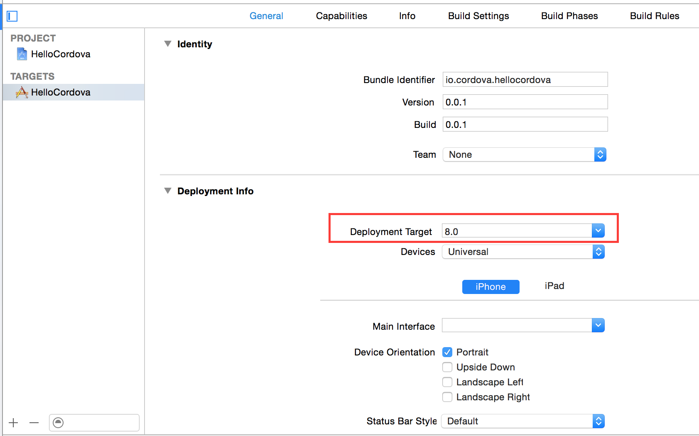
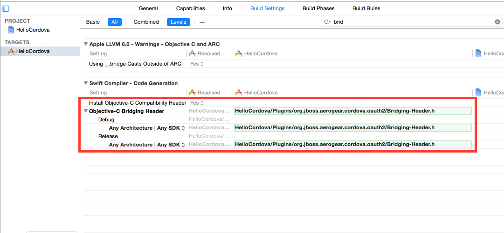
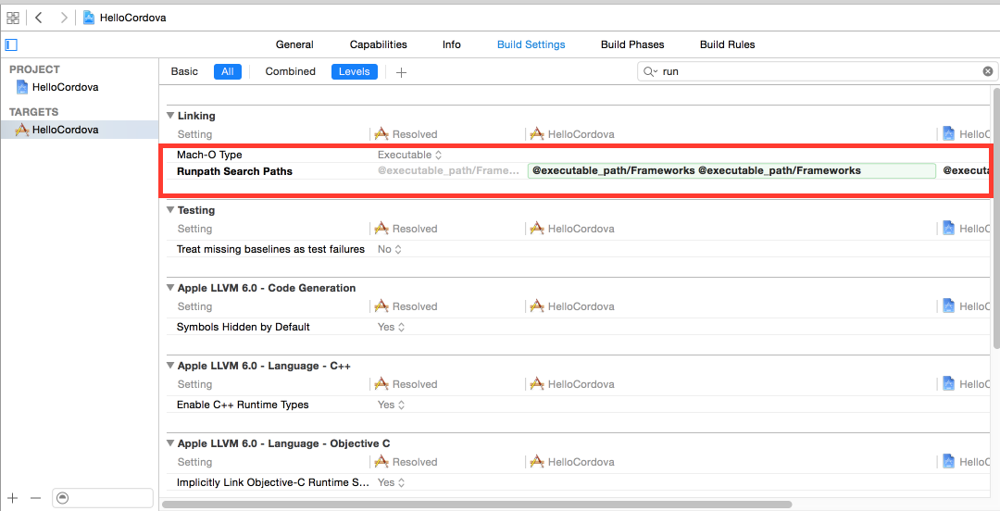

Xcode
=====

When you open the xcode project the changes made to it with the `build.xconfig` file will not be reflected. To make the project build again make the following changes:

1. change `deployment target` to 7.0 or above

2. add `[Project Name]/plugins/org.jboss.aerogear.cordova.oauth2/src/ios/Bridging-Header.h` to Objective-c Bridging Header under the Swift Compiler - Code Generation options

3. set `Runpath Search Paths` to "$(inherited) @executable_path/Frameworks"

